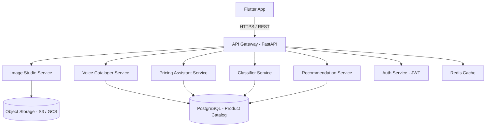

# ShilpSetu — AI/ML Backend Implementation Plan

> **Project Codename:** ShilpSetu  
> **Stack:** Python · FastAPI · PyTorch / TensorFlow · HuggingFace · Google Cloud / AWS  
> **Scope:** All AI/ML micro-services consumed by the Flutter app via REST APIs

---

## Overview

ShilpSetu's AI engine acts as the "virtual business manager" for marginalized artisans. Five ML pipelines handle image enhancement, multilingual voice cataloging, dynamic pricing, product classification, and a smart recommendation engine. Each pipeline is packaged as an independent micro-service behind a unified API gateway, ensuring horizontal scalability and clean separation of concerns.

---

## Feature Set (5 AI Pillars)

| # | Feature | Primary AI Tech |
|---|---------|----------------|
| 1 | **AI Image Studio** | Background removal (SAM / rembg) + GFPGAN + Real-ESRGAN |
| 2 | **Multilingual Voice Cataloger** | Whisper ASR → NLLB-200 translation → GPT-4o / Llama-3 |
| 3 | **Dynamic Pricing Assistant** | Gradient Boosting (XGBoost) + CLIP visual embeddings |
| 4 | **Smart Product Classifier** | EfficientNet-B4 fine-tuned on handicraft taxonomy |
| 5 | **Buyer Match & Recommendation** | Collaborative filtering + semantic search (FAISS) |

---

## Architecture Overview



---

## Proposed Changes / Build Plan

---

### 1 · AI Image Studio Service

**Goal:** Transform raw artisan photos into professional e-commerce-ready images entirely on the server.

#### Pipeline Steps

```
Raw Upload → Format Validation → Background Removal → 
Super-Resolution Upscaling → Color Correction → 
White-Balance Normalization → Output (PNG/WebP)
```

#### Models & Libraries

| Task | Model / Library | Notes |
|------|-----------------|-------|
| Background removal | `rembg` (U²-Net) or Meta SAM | SAM for complex scenes |
| Super-resolution | Real-ESRGAN (4× upscale) | Weights ~67 MB |
| Lighting / color fix | PIL + OpenCV CLAHE | Rule-based, low latency |
| Image quality check | BRISQUE / NIQE scorer | Auto-reject blurry inputs |

#### [NEW] `services/image_studio/`
- `main.py` — FastAPI router (`POST /enhance`)
- `pipeline.py` — Orchestrates rembg → ESRGAN → color correction
- `models/` — Downloaded weights (gitignored)
- `utils/quality_check.py` — BRISQUE scorer, rejects images below threshold

#### API Contract
```
POST /api/v1/image/enhance
Content-Type: multipart/form-data
Body: { file: <image>, output_format: "webp" }

Response 200:
{
  "enhanced_url": "https://cdn.shilpsetu.in/products/abc123.webp",
  "quality_score": 87.4,
  "processing_time_ms": 1240
}
```

---

### 2 · Multilingual Voice Cataloger Service

**Goal:** Accept a voice note in any Indian regional language and produce a professional, SEO-rich product description in English and Hindi.

#### Pipeline Steps

```
Audio Upload (MP3/WAV/OGG) → 
Whisper ASR (speech → regional text) → 
NLLB-200 Translation (→ English) → 
LLM Prompt Engine (structured description generation) → 
SEO Keyword Injector → 
Dual Output (EN + HI)
```

#### Models & Libraries

| Task | Model | Hosting |
|------|-------|---------|
| ASR (Speech-to-Text) | `openai/whisper-large-v3` | Self-hosted on GPU / OpenAI API |
| Translation | `facebook/nllb-200-distilled-600M` | HuggingFace Inference |
| Description Generation | GPT-4o-mini via OpenAI API | API call |
| Hindi Output | NLLB-200 back-translation | Same model |

#### Supported Regional Languages
Hindi · Bengali · Tamil · Telugu · Kannada · Marathi · Gujarati · Odia · Punjabi · Assamese

#### [NEW] `services/voice_cataloger/`
- `main.py` — FastAPI router (`POST /catalog/voice`)
- `asr.py` — Whisper inference wrapper
- `translate.py` — NLLB-200 wrapper with language detection
- `description_gen.py` — LLM prompt templates per product category
- `seo_injector.py` — Injects trending handicraft keywords from keyword DB

#### Prompt Template (Example)
```
System: You are an expert e-commerce copywriter for Indian handicrafts.
User: Product described by artisan (translated): "{translated_text}"
      Category: "{category}"
      Generate: 
        - Title (max 80 chars, SEO optimized)
        - Short Description (150 words)
        - Key Features (5 bullet points)
        - Tags (10 comma-separated)
      Format: JSON
```

#### API Contract
```
POST /api/v1/catalog/voice
Body: { audio: <file>, language_hint: "hi" }

Response 200:
{
  "detected_language": "te",
  "raw_transcript": "...",
  "catalog": {
    "title_en": "Handwoven Pochampally Ikat Silk Saree...",
    "title_hi": "हस्तनिर्मित पोचमपल्ली इकत सिल्क साड़ी...",
    "description_en": "...",
    "description_hi": "...",
    "tags": ["ikat", "handloom", "silk saree", ...]
  }
}
```

---

### 3 · Dynamic Pricing Assistant Service

**Goal:** Given a product image + description, predict an optimal competitive price using market trend data.

#### Pipeline Steps

```
Product Image → CLIP Visual Embeddings →
                                          → Feature Vector →
Product Description → TF-IDF / SBERT →                     XGBoost Regressor → Price Range
                                          
Market Data API (scraped weekly) → Price Index Features →
```

#### Data Sources for Training

| Source | Data Type |
|--------|-----------|
| Government e-Marketplace (GeM) | B2G product prices |
| Craftsvilla / Jaypore (scraped) | B2C market prices |
| Amazon Handmade India | Competitor pricing |
| Raw material cost indices (RBI) | Cost baseline |

#### Model Architecture

- **Feature Extraction:** CLIP (`ViT-B/32`) → 512-dim visual embedding
- **Text Features:** Sentence-BERT embeddings (384-dim)
- **Tabular Features:** Category, material, region, dimensions, weight
- **Regressor:** XGBoost with price range output (min, suggested, max)
- **Retraining:** Automated weekly retraining pipeline via Apache Airflow

#### [NEW] `services/pricing_assistant/`
- `main.py` — FastAPI router (`POST /pricing/suggest`)
- `feature_extractor.py` — CLIP + SBERT feature pipeline
- `model.py` — XGBoost model loader and inference
- `market_data/scraper.py` — Weekly market data collection
- `training/train.py` — Model retraining pipeline

#### API Contract
```
POST /api/v1/pricing/suggest
Body: { product_id: "xyz", image_url: "...", description: "..." }

Response 200:
{
  "price_range": {
    "min": 450,
    "suggested": 680,
    "max": 950
  },
  "currency": "INR",
  "confidence": 0.83,
  "market_insights": {
    "avg_category_price": 620,
    "trending": true,
    "competitor_count": 142
  }
}
```

---

### 4 · Smart Product Classifier Service

**Goal:** Automatically classify uploaded products into a hierarchical handicraft taxonomy (Category → Sub-category → Craft Type).

#### Taxonomy Levels
```
Level 1: Textiles | Pottery | Jewelry | Woodcraft | Metalcraft | Paintings | Leather
Level 2: e.g. Textiles → Sarees | Shawls | Dupattas | Fabric Rolls
Level 3: e.g. Sarees → Banarasi | Kanjeevaram | Pochampally | Chanderi
```

#### Model
- **Base:** EfficientNet-B4 pre-trained on ImageNet
- **Fine-tuning:** Custom dataset of ~50,000 handicraft images (sourced from GeM + Craftroot + open datasets)
- **Training:** 3-stage fine-tuning with progressive unfreezing
- **Output:** Top-3 predictions with confidence scores

#### [NEW] `services/classifier/`
- `main.py` — FastAPI router (`POST /classify`)
- `model.py` — EfficientNet-B4 inference
- `taxonomy.json` — Full 3-level handicraft taxonomy
- `training/` — Training scripts and dataset management

---

### 5 · Buyer Match & Recommendation Service

**Goal:** Match artisan products with potential B2B buyers (NGOs, government departments, exporters) using semantic similarity and collaborative filtering.

#### Approach
- **Content-Based:** CLIP embeddings of product images stored in FAISS vector index
- **Collaborative Filtering:** Matrix factorization on buyer-product interaction logs
- **Hybrid Scoring:** Weighted blend of both signals

#### [NEW] `services/recommender/`
- `main.py` — FastAPI router (`GET /match/buyers`)
- `vector_store.py` — FAISS index management
- `collaborative.py` — Implicit ALS model (Implicit library)
- `hybrid_scorer.py` — Weighted blend logic

---

## Infrastructure & DevOps

### Compute Requirements

| Service | GPU Required | Min RAM | Recommended Instance |
|---------|-------------|---------|----------------------|
| Image Studio | Yes (inference) | 8 GB | AWS g4dn.xlarge / GCP T4 |
| Voice Cataloger | Yes (Whisper) | 16 GB | AWS g4dn.xlarge |
| Pricing Assistant | No | 4 GB | AWS t3.medium |
| Classifier | Yes | 8 GB | AWS g4dn.xlarge |
| Recommender | No | 4 GB | AWS t3.medium |

### Tech Stack Summary

| Layer | Technology |
|-------|-----------|
| API Framework | FastAPI + Uvicorn |
| Task Queue | Celery + Redis |
| Model Serving | Torch Serve / ONNX Runtime |
| Storage | AWS S3 / GCS |
| Database | PostgreSQL + pgvector |
| Vector Search | FAISS |
| CI/CD | GitHub Actions → Docker → K8s |
| Monitoring | Prometheus + Grafana |
| Retraining | Apache Airflow |

---

## Directory Structure

```
shilpsetu-ai/
├── api_gateway/              # FastAPI main app, routing, auth
├── services/
│   ├── image_studio/
│   ├── voice_cataloger/
│   ├── pricing_assistant/
│   ├── classifier/
│   └── recommender/
├── shared/
│   ├── auth/                 # JWT utilities
│   ├── db/                   # SQLAlchemy models
│   └── storage/              # S3/GCS client
├── training/                 # Standalone training scripts
├── data/                     # Dataset management scripts
├── infra/
│   ├── docker/               # Dockerfiles per service
│   └── k8s/                  # Kubernetes manifests
└── tests/
    ├── unit/
    └── integration/
```

---

## Development Phases

### Phase 1 — Foundation (Weeks 1–3)
- [ ] Set up FastAPI gateway with JWT auth
- [ ] Implement Image Studio (rembg + ESRGAN)
- [ ] Deploy to staging with Docker Compose

### Phase 2 — Language AI (Weeks 4–6)
- [ ] Integrate Whisper ASR
- [ ] Integrate NLLB-200 translation
- [ ] Build LLM prompt engine + SEO injector

### Phase 3 — Pricing & Classification (Weeks 7–9)
- [ ] Collect and label handicraft dataset
- [ ] Fine-tune EfficientNet-B4 classifier
- [ ] Build CLIP + XGBoost pricing pipeline

### Phase 4 — Recommendations & Scale (Weeks 10–12)
- [ ] Build FAISS vector store + buyer matching
- [ ] Set up Airflow retraining pipelines
- [ ] Production deployment on K8s

---

## Verification Plan

### Automated Tests
```bash
pytest tests/unit/ -v
pytest tests/integration/ -v --docker
```

### Model Evaluation Metrics

| Service | Metric | Target |
|---------|--------|--------|
| Image Studio | SSIM score | > 0.85 |
| Voice Cataloger | WER (ASR) | < 15% |
| Pricing Assistant | MAPE | < 18% |
| Classifier | Top-3 Accuracy | > 92% |
| Recommender | NDCG@10 | > 0.75 |

### Load Testing
- Locust load tests: 100 concurrent users per service
- Target: p95 latency < 3s for image processing, < 5s for voice cataloging
